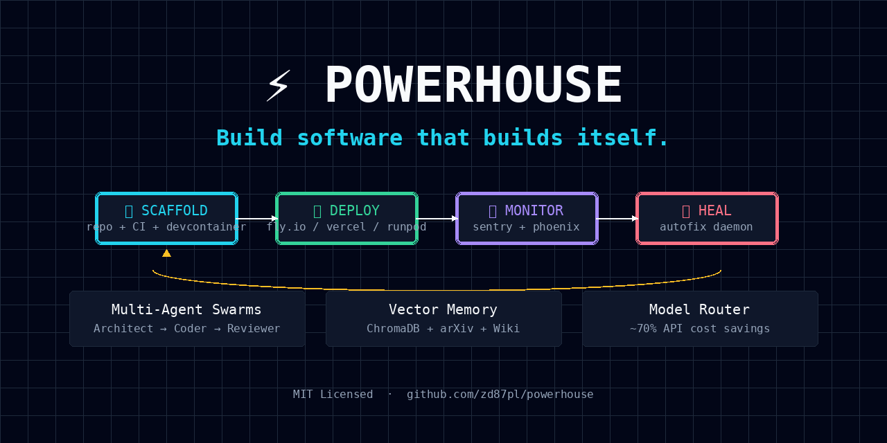

<div align="center">



# ⚡ POWERHOUSE

### **Build software that builds itself.**

> *The autonomous AI engineering platform. Scaffold → Deploy → Monitor → Heal.*

[](https://opensource.org/licenses/MIT)
[](https://python.org)
[](https://nodejs.org)
[](https://docker.com)

[📖 Docs](https://github.com/zd87pl/powerhouse#-quick-start) · [🏗️ Scaffold](https://github.com/zd87pl/powerhouse#-project-scaffold) · [🤖 Swarms](https://github.com/zd87pl/powerhouse#-multi-agent-swarms) · [🔧 Autofix](https://github.com/zd87pl/powerhouse#-self-healing-production)

</div>

---

## 🔥 The Pitch

Every other AI coding tool stops at **generation**.  
Powerhouse doesn't stop until your code is **alive, monitored, and self-healing.**

```
┌─────────────┐     ┌─────────────┐     ┌─────────────┐     ┌─────────────┐
│  💬 Chat    │────▶│ 🏗️ Scaffold  │────▶│ 🚀 Deploy    │────▶│ 📡 Monitor  │
│  "Build me  │     │  repo + CI   │     │  Fly.io /    │     │  Sentry +   │
│   a store"  │     │  + DevCont   │     │  Vercel      │     │  Phoenix    │
└─────────────┘     └─────────────┘     └─────────────┘     └──────┬──────┘
                                                                    │
                                              ┌─────────────────────▼──────┐
                                              │    🔧 ERROR DETECTED       │
                                              │    NullPointerException    │
                                              │    user.auth:42            │
                                              └──────────┬─────────────────┘
                                                         │
                                              ┌──────────▼─────────────────┐
                                              │  🤖 AUTOFIX DAEMON WAKES   │
                                              │  → Diagnoses with LLM      │
                                              │  → Patches the bug         │
                                              │  → Opens GitHub PR         │
                                              └──────────┬─────────────────┘
                                                         │
                                              ┌──────────▼─────────────────┐
                                              │  ✅ CI passes → Merged     │
                                              │  🧠 Learned → Wiki updated │
                                              └────────────────────────────┘
```

> **This is not chatGPT with a deploy button. This is an AI engineering organization in a box.**

---

## ✨ What You Get

### 🏗️ One-Command Project Scaffold
Give it a name and a stack. It creates:
- GitHub repo with branch protection
- DevContainer definition (VS Code → one-click open)
- Fly.io app + database (or Vercel for frontends)
- GitHub Actions CI (test → lint → deploy)
- Sentry error tracking
- ChromaDB vector index for project memory
- Prometheus metrics endpoint
- README, LICENSE, `.gitignore`

```bash
powerhouse scaffold my-app --stack nextjs --deploy vercel
# 60 seconds later: live URL in your terminal
```

### 🤖 Multi-Agent Swarms
Not one model. A **team** of models:

| Agent | Model | Job |
|-------|-------|-----|
| 🏛️ **Architect** | Claude Opus 4 | Writes the spec, designs the schema, plans the files |
| 👨‍💻 **Coder** | Nemotron-3-Super | Implements clean, typed, tested code |
| 🔍 **Reviewer** | Claude Sonnet 4 | Validates against spec — PASS or REVISE |
| 🚀 **DevOps** | GPT-4o | Deploys, configures secrets, manages infra |
| 🧪 **Tester** | Local 8B | Runs edge cases, fuzzes inputs |

They loop until the Reviewer says **PASS**. Then it opens a PR.

### 🔧 Self-Healing Production
Your app throws an error at 3am. Here's what happens **without you waking up:**

1. **Sentry** catches it
2. **Autofix daemon** polls, reads stack trace
3. **LLM** diagnoses root cause
4. **Patch generated** and committed to branch
5. **PR opened** with full description
6. **CI runs** — if green, you wake up to a merged fix

### 🧠 Persistent Vector Memory
Everything is remembered:
- Code decisions → indexed in ChromaDB
- arXiv papers → auto-downloaded & searchable
- Blog posts → RSS-watched & summarized
- Error patterns → learned, not repeated

```python
# "How did we handle auth last time?"
results = wiki.query("JWT refresh token pattern")
# → Returns your ADR-005 + the exact file + the PR that merged it
```

### 🎯 Model Router
Every task goes to the **right** model, not the biggest:

```yaml
architect:  anthropic/claude-opus-4     # Specs need reasoning
coder:      nvidia/nemotron-3-super    # Code needs precision
reviewer:   anthropic/claude-sonnet-4  # Review needs balance
quick_chat: local/llama-3.1-8b         # Fast & free
```

Saves ~70% on API costs vs. using GPT-4o for everything.

### 🏢 SaaS-Ready Multi-Tenancy *(Phase 4)*
Package it as a product. One signup → isolated workspace in 60s:
- Schema-per-tenant Postgres
- Collection-per-tenant ChromaDB
- Prefix-per-tenant object storage
- Clerk org/team auth + SSO
- Stripe prepaid credits billing
- Hard quota ceilings (no surprise bills)

---

## 🚀 Quick Start

### 1. Clone

```bash
git clone https://github.com/zd87pl/powerhouse.git
cd powerhouse
```

### 2. Configure

```bash
cp infra/bootstrap/.envrc.example infra/bootstrap/.envrc
# Edit with your keys — .envrc is gitignored, never committed
source infra/bootstrap/.envrc
```

### 3. Install Tools

```bash
./infra/bootstrap/bootstrap-clis.sh
# Installs: fly, vercel, supabase, sentry-cli, wrangler, gh
```

### 4. Authenticate

```bash
fly auth token
vercel login
supabase login
git config --global user.email "you@example.com"
git config --global user.name "Your Name"
```

### 5. Start Core Services

```bash
./infra/scripts/start-services.sh
```

| Service | URL | Purpose |
|---------|-----|---------|
| ChromaDB | `http://localhost:8001` | Vector search |
| n8n | `http://localhost:5678` | Workflow automation |

### 6. Index Knowledge Base

```bash
./infra/scripts/index-wiki.sh
```

---

## 🏗️ Project Scaffold

```bash
# Scaffold a Next.js storefront
powerhouse scaffold curvy-store --stack nextjs --deploy vercel

# Scaffold a FastAPI backend
powerhouse scaffold api-service --stack fastapi --deploy flyio

# What happens:
# 1. GitHub repo created
# 2. DevContainer configured
# 3. CI/CD pipeline live
# 4. Database provisioned
# 5. Sentry project created
# 6. Deployed to production
```

---

## 🤖 Multi-Agent Swarms

```python
from services.orchestrator.state import SwarmRun

run = SwarmRun(
    task_id="feat-oauth-001",
    spec="Add Google OAuth2 login with refresh tokens",
    project="my-app"
)

# Architect designs it
run.status = "architect"
run.architect_output = architect_agent.plan(run.spec)

# Coder implements it
run.status = "coding"
run.coder_output = coder_agent.implement(run.architect_output)

# Reviewer validates it
run.status = "review"
verdict = reviewer_agent.review(run.coder_output, run.architect_output)

if verdict == "PASS":
    github.create_pr(run)
else:
    run.status = "revising"
    # Loop back to Coder with feedback
```

---

## 🔧 Self-Healing Production

Drop any alert JSON into:
```bash
/data/powerhouse/observability-bridge/alerts/
```

The autofix daemon:
1. Reads the alert
2. Queries the LLM for diagnosis
3. Generates a patch
4. Opens a GitHub PR
5. Updates the alert status

Or wire it to **Sentry webhooks** for fully autonomous operation:
```bash
curl -X POST http://localhost:8002/webhook/sentry \
  -H "Content-Type: application/json" \
  -d @alert.json
```

---

## 🧠 Knowledge Base

```bash
# Query everything we've ever learned
curl http://localhost:8001/api/v1/collections/wiki/query \
  -d '{"query_texts": ["How does tenant isolation work?"], "n_results": 3}'
```

All of this is **automatically maintained**:
- Weekly arXiv scans for new ML papers
- RSS monitoring for industry blogs
- Every project decision indexed
- Every error pattern remembered

---

## 📊 Architecture

```
┌──────────────────────────────────────────────────────────────────┐
│                         POWERHOUSE                                │
├────────────┬──────────────┬─────────────┬───────────────────────┤
│ 🧠 RAG     │ 🤖 Swarms    │ 🚀 Deploy   │ 📡 Observe            │
│  Wiki      │  Architect   │  Fly.io     │  Sentry               │
│  ChromaDB  │  Coder       │  Vercel     │  Phoenix              │
│  arXiv     │  Reviewer    │  RunPod     │  Prometheus           │
│  Blogs     │  DevOps      │  Supabase   │  Autofix              │
│            │  Tester      │  Cloudflare │                       │
└────────────┴──────────────┴─────────────┴───────────────────────┘
                         │
              ┌──────────▼──────────┐
              │  /data/powerhouse/  │
              │  Persistent disk    │
              └─────────────────────┘
```

[Read the full architecture →](docs/architecture.md)

---

## 📋 Roadmap

| Phase | Focus | Timeline |
|-------|-------|----------|
| **Foundation** | Vector DB, DevContainers, model router | ✅ Ready |
| **Autonomy** | Multi-agent swarms, autofix, DB branching | 🚧 Active |
| **Scale** | Temporal workflows, fine-tuned models, KB monitor | 📅 Planned |
| **SaaS** | Multi-tenant platform, billing, landing page | 📅 14 weeks |

[Full roadmap →](docs/roadmap.md)

---

## 🛡️ Why This Exists

| | Bolt | Lovable | v0 | Replit | **Powerhouse** |
|---|---|---|---|---|---|
| Code generation | ✅ | ✅ | ✅ | ⚠️ | ✅ |
| One-click deploy | ✅ | ✅ | ✅ | ✅ | ✅ |
| CI/CD pipelines | ❌ | ❌ | ❌ | ❌ | ✅ |
| Error monitoring | ❌ | ❌ | ❌ | ❌ | ✅ |
| **Self-healing** | ❌ | ❌ | ❌ | ❌ | **✅** |
| **Vector memory** | ❌ | ❌ | ❌ | ❌ | **✅** |
| Multi-agent teams | ❌ | ❌ | ⚠️ | ❌ | ✅ |
| GPU + CPU hybrid | ❌ | ❌ | ❌ | ❌ | ✅ |
| Open source | ❌ | ❌ | ❌ | ❌ | **✅ MIT** |

> **No competitor offers autonomous self-healing. That's our moat.**

---

## 🎯 Use Cases

- **Solo founder** — Ship 10x faster. Agent does the coding. You do the vision.
- **Small agency** — One platform for all client projects. Auto-deploy, auto-fix.
- **Platform team** — Internal developer tooling. GitHub Copilot → Powerhouse upgrade.
- **AI researcher** — RunPod integration for training + evaluation pipelines.

---

## 🤝 Contributing

Pull requests welcome. See [docs/implementation-plan.md](docs/implementation-plan.md) for the 14-week build plan and open issues for specific gaps.

**Good first issues:**
- Add LiteLLM proxy to `infra/docker-compose.yml`
- Write `powerhouse` CLI wrapper in Python/Go
- Add Stripe billing webhook handler
- Create landing page with `stitch-mcp` skill

---

## 📜 License

MIT — see [LICENSE](LICENSE). Use it. Fork it. Build a unicorn with it.

---

<div align="center">

**Built with ⚡ by Ziggy**

[⭐ Star this repo](https://github.com/zd87pl/powerhouse) · [🐦 Follow on X](https://x.com) · [💬 Discussions](https://github.com/zd87pl/powerhouse/discussions)

</div>
